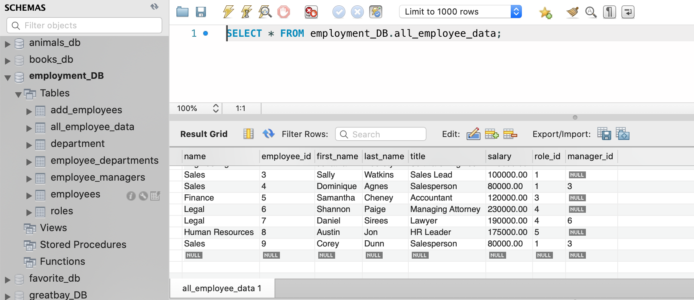
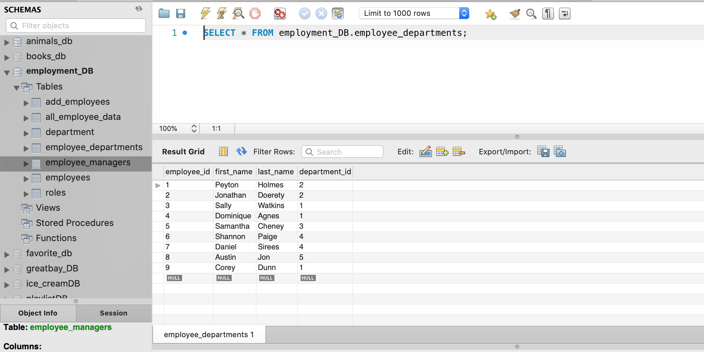
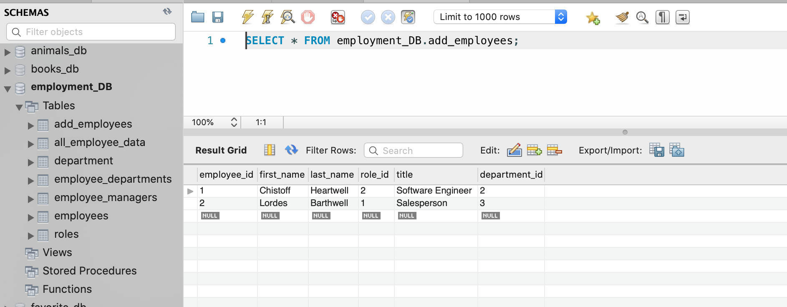
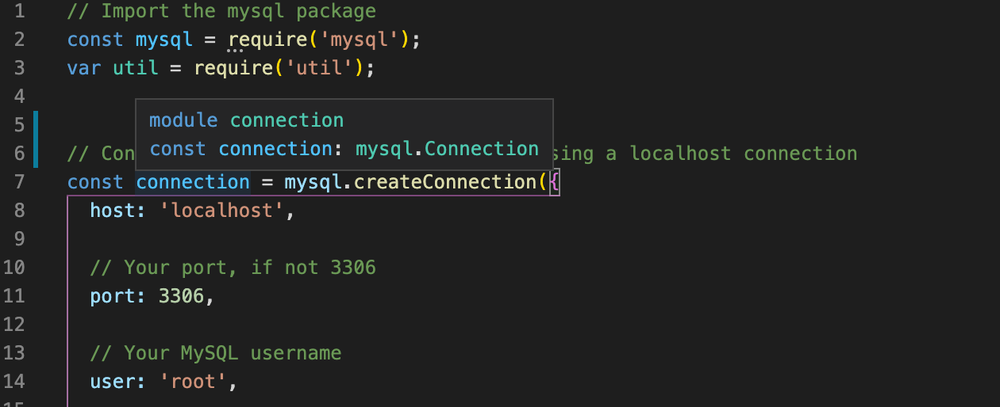
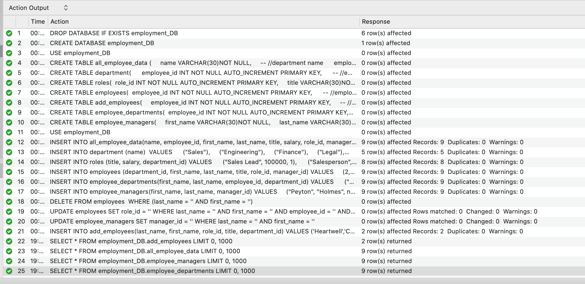

# EmploymentDB
To create an employee database with high functionality using Node and mySQL.

# Project Description
To create an application that can be used to write, save, and delete and update employment file systems. This application uses an application called mySQL and filesystem inquirer.

# Demo Features:
* The following image and gif shows the web application's appearance and functionality:
  

# Live URL:
<a href="https://youtu.be/wI8kryj1rTM">EmploymentDB Youtube Video</a>

<a href="https://github.com/sjohn214/EmploymentDB.git">EmploymentDB GitHub Repo</a>

# Summary
* In this project we created an application that will allow users to dynamically make changes to an employment database system.

# Special Features:
* 2 Javascript pages

  * employmentDBConnection.js
  

  * index.js

# Special Features Continued:
  * mySQL
  * Arrays with objects
  * Jquery language
  * Schemas file

  * Seed file
  * Functions
  * Installed npm package mysql and inquirer
  * Installed package-json

# Authors/Contributors
* Shannondale Page (student) <a href="https://github.com/sjohn214">Git Hub Profile</a>
* Austin Bruch (Bootcamp Instructor)
* Jon Jackson (Bootcamp TA Instructor)
* Daniel Sires (Bootcamp Tutor)